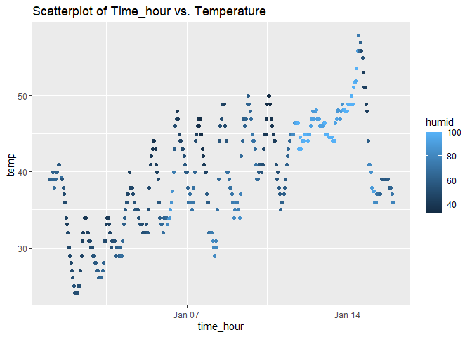

p8015_hw1_ajt2206
================
Andy Turner
2023-09-18

# Problem 1

Loading package and data for Problem 1

``` r
library("moderndive")
library("tidyverse")
```

    ## ── Attaching core tidyverse packages ──────────────────────── tidyverse 2.0.0 ──
    ## ✔ dplyr     1.1.2     ✔ readr     2.1.4
    ## ✔ forcats   1.0.0     ✔ stringr   1.5.0
    ## ✔ ggplot2   3.4.2     ✔ tibble    3.2.1
    ## ✔ lubridate 1.9.2     ✔ tidyr     1.3.0
    ## ✔ purrr     1.0.1     
    ## ── Conflicts ────────────────────────────────────────── tidyverse_conflicts() ──
    ## ✖ dplyr::filter() masks stats::filter()
    ## ✖ dplyr::lag()    masks stats::lag()
    ## ℹ Use the conflicted package (<http://conflicted.r-lib.org/>) to force all conflicts to become errors

``` r
data("early_january_weather")
```

Defining temp as the temp variable within the early_january_weather
dataset.

``` r
temp<- early_january_weather$temp
```

**Description of Variables and Dataset**

1.  This dataset provides hourly meterological data for LGA, JFK, and
    EWR for the month of January 2013.

2.  The variables are as follows origin, year, month, day, hour, temp,
    dewp, humid, wind_dir, wind_speed, wind_gust, precip, pressure,
    visib, time_hour.

3.  Key variables are defined as the follolwing. temp: Temperature in F.
    humid: relative humidity. time_hour: Date and hour of the recording
    as a POSIXct date.

4.  There are 358 rows and 15 columns.

5.  The mean temperature is 39.58 degrees Fahrenheit.

``` r
ggplot(early_january_weather, aes(x = time_hour, y = temp, color=humid)) + 
  geom_point() +
  labs(title="Scatterplot of Time_hour vs. Temperature")
```

<!-- -->

**Patterns in the data**

- At higher temperatures, humidity is also higher.

- The temperature increased overall through the observed period before
  dropping quickly around January 14th.

**Saving Scatterplot to Github**

``` r
ggsave("hw1_scatterplot.png", plot= last_plot(), width=6, height=4, dpi = 300)
```

# Problem 2

Creating a data frame:

``` r
hw2_df= 
  tibble(
    ran_samp<- rnorm(10),
    log_vec<- ran_samp > 0,
    char_vec<- c("A", "B", "C", "D", "E", "F", "G", "H", "I", "J"),
    fact_vec<- factor(rep(c("Level 1", "Level 2", "Level 3"), times= c(4, 3, 3)))
  )
```
